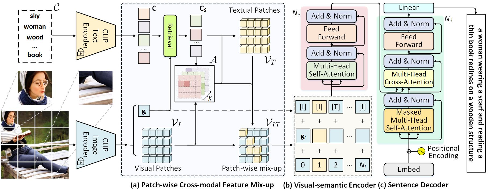

# Unleashing Text-to-Image Diffusion Prior for Zero-Shot Image Captioning [ECCV24]

This is the official repository for **Unleashing Text-to-Image Diffusion Prior for Zero-Shot Image Captioning [ECCV24]**, mainly for the proposed framework PCM-Net.

## Framework


- **Salient Visual Concept Detection:** For each input image, salient visual concepts are detected based on image-text similarity in CLIP space.
- **Patch-wise Feature Fusion:** Selectively fuses patch-wise visual features with textual features of salient concepts, creating a mixed-up feature map with reduced defects.
- **Visual-Semantic Encoding:** A visual-semantic encoder refines the feature map, which is then used by the sentence decoder for generating captions.
- **CLIP-weighted Cross-Entropy Loss:** A novel loss function prioritizes high-quality image-text pairs over low-quality ones, enhancing model training with synthetic data.


## Data Preparation

- [SynthImgCap Dataset](https://jianjieluo.github.io/SynthImgCap/#SynthImgCap) is available.
- We use [OpenAI-CLIP-Feature](https://github.com/jianjieluo/OpenAI-CLIP-Feature) to extract the visual CLIP features of synthetic images at training and GT real images at inference.
- META ANNO DATA will be released soon...


## Training
Please refer to `scripts/train.sh`.


## Inference
Please refer to `scripts/final_eval_for_paper.sh`.


## Citation
If you use the SynthImgCap dataset or code or models for your research, please cite:

```
@inproceedings{luo2024unleashing,
    title = {Unleashing Text-to-Image Diffusion Prior for Zero-Shot Image Captioning},
    author = {Luo, Jianjie and Chen, Jingwen and Li, Yehao and Pan, Yingwei and Feng, Jianlin and Chao, Hongyang and Yao, Ting},
    booktitle = {European Conference on Computer Vision (ECCV)},
    year = {2024}
}
```

## Acknowledgement
This code used resources from [X-Modaler Codebase](https://github.com/YehLi/xmodaler) and [DenseCLIP code](https://github.com/raoyongming/DenseCLIP). We thank the authors for open-sourcing their awesome projects.


## License

MIT
